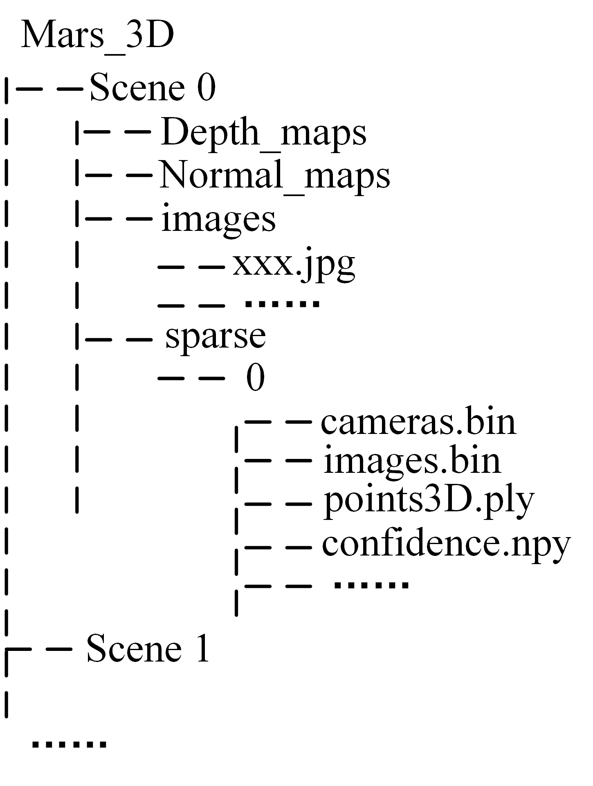

## Mars_3D Dataset introduction

### 1.Structure

## 2.Statement

The original remote sensing images of the Martian surface in this dataset are from NASA's official website. For details:[Guidelines for using NASA Images and Media Guidelines](https://www.nasa.gov/nasa-brand-center/images-and-media/)

## 3.Download

通过网盘分享的文件：Mars_3D
链接:  https://pan.baidu.com/s/1IVQEq3gtcJK8szzf6MRL3g?pwd=m3uv 提取码: m3uv

## 4.Paper

ESGS: A 3D Reconstruction Method for the Martian Surface Based on Optical Remote Sensing Images
